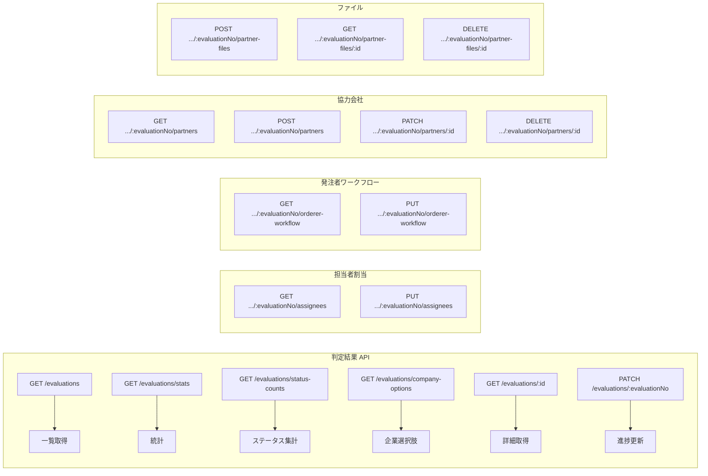
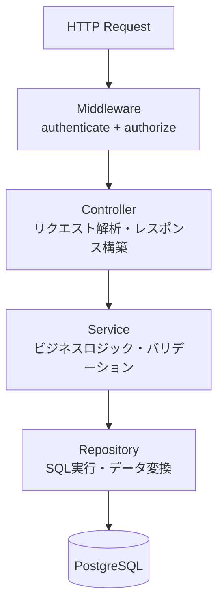

# Backend API 仕様書

## 1. 共通設定

| 項目 | 値 |
|------|-----|
| Base URL | `http://localhost:8080` (開発) / Cloud Run URL (本番) |
| 認証 | JWT Bearer Token (`Authorization: Bearer <token>`) |
| Body形式 | JSON (`Content-Type: application/json`) |
| Body上限 | 10MB (環境変数 `EXPRESS_JSON_LIMIT`) |
| CORS | `CORS_ORIGIN` 環境変数で制御 |

### 認証・認可

- `/api/*` 配下の全エンドポイントに `authenticate` ミドルウェア適用
- `/health`, `/readiness`, `/` は認証不要
- `AUTH_ENABLED=false`（デフォルト）の場合、admin権限のダミーユーザーが自動設定
- ロール: `admin`, `evaluator`, `orderer`, `auditor`

### エラーレスポンス形式

```json
{ "error": "エラーメッセージ" }
```

- 400: リクエスト不正
- 404: リソース未発見
- 409: 重複（Conflict）
- 413: ファイルサイズ超過
- 500: サーバーエラー（本番では詳細非表示）

---

## 2. ヘルスチェック

| メソッド | パス | 認証 | 概要 |
|---------|------|------|------|
| GET | `/health` | 不要 | ヘルスチェック |
| GET | `/readiness` | 不要 | DB接続確認 |

---

## 3. Evaluation（判定結果）



| メソッド | パス | 認可 | 概要 |
|---------|------|------|------|
| GET | `/api/evaluations` | 認証のみ | 一覧（サーバーサイドページネーション） |
| GET | `/api/evaluations/stats` | 認証のみ | 統計サマリー |
| GET | `/api/evaluations/status-counts` | 認証のみ | ステータス別件数 |
| GET | `/api/evaluations/company-options` | 認証のみ | 企業選択肢（検索） |
| GET | `/api/evaluations/:id` | 認証のみ | 詳細取得 |
| PATCH | `/api/evaluations/:evaluationNo` | admin, evaluator | 進捗状態更新 |
| GET | `/api/evaluations/:evaluationNo/assignees` | 認証のみ | 担当者一覧 |
| PUT | `/api/evaluations/:evaluationNo/assignees` | admin, evaluator | 担当者設定 |
| GET | `/api/evaluations/:evaluationNo/orderer-workflow` | 認証のみ | 発注者WF状態取得 |
| PUT | `/api/evaluations/:evaluationNo/orderer-workflow` | admin, evaluator, orderer | 発注者WF状態更新 |
| GET | `/api/evaluations/:evaluationNo/partner-workflow` | 認証のみ | 協力会社WF状態取得 |
| PUT | `/api/evaluations/:evaluationNo/partner-workflow` | admin, evaluator | 協力会社WF状態更新 |
| GET | `/api/evaluations/:evaluationNo/partners` | 認証のみ | 協力会社候補一覧 |
| POST | `/api/evaluations/:evaluationNo/partners` | admin, evaluator | 協力会社候補追加 |
| PATCH | `/api/evaluations/:evaluationNo/partners/:partnerId` | admin, evaluator | 協力会社候補更新 |
| DELETE | `/api/evaluations/:evaluationNo/partners/:partnerId` | admin, evaluator | 協力会社候補削除 |
| POST | `/api/evaluations/:evaluationNo/partner-files` | admin, evaluator | ファイルアップロード (上限15MB) |
| GET | `/api/evaluations/:evaluationNo/partner-files/:fileId` | admin, evaluator | ファイル取得 |
| DELETE | `/api/evaluations/:evaluationNo/partner-files/:fileId` | admin, evaluator | ファイル削除 |

### 一覧クエリパラメータ

| パラメータ | 型 | 概要 |
|-----------|-----|------|
| page | number | ページ番号 |
| pageSize | number | ページサイズ（最大1000） |
| statuses | string | ステータスフィルタ（カンマ区切り） |
| workStatuses | string | 進捗ステータスフィルタ |
| priorities | string | 優先度フィルタ |
| categories | string | カテゴリフィルタ |
| categorySegments | string | カテゴリ区分フィルタ |
| categoryDetails | string | カテゴリ詳細フィルタ |
| bidTypes | string | 入札方式フィルタ |
| organizations | string | 発注機関フィルタ |
| prefectures | string | 都道府県フィルタ |
| officeIds | string | 拠点IDフィルタ |
| searchQuery | string | テキスト検索 |
| sortField | string | ソートフィールド |
| sortOrder | string | ソート順序 (asc/desc) |
| ordererId | string | 発注者IDフィルタ |

---

## 4. Announcement（公告・案件）

| メソッド | パス | 認可 | 概要 |
|---------|------|------|------|
| GET | `/api/announcements` | 認証のみ | 一覧（サーバーサイドページネーション） |
| GET | `/api/announcements/:announcementNo` | 認証のみ | 詳細取得 |
| GET | `/api/announcements/:announcementNo/progressing-companies` | 認証のみ | 着手企業一覧 |
| GET | `/api/announcements/:announcementNo/similar-cases` | 認証のみ | 類似案件一覧 |
| GET | `/api/announcements/:announcementNo/documents/:documentId/preview` | 認証のみ | 文書プレビュー（バイナリ、キャッシュ1時間） |

---

## 5. Partner（協力会社）

| メソッド | パス | 認可 | 概要 |
|---------|------|------|------|
| GET | `/api/partners` | 認証のみ | 一覧（サーバーサイドページネーション） |
| GET | `/api/partners/:id` | 認証のみ | 詳細取得 |
| POST | `/api/partners` | admin, evaluator | 新規登録 |
| PATCH | `/api/partners/:id` | admin, evaluator | 更新 |
| DELETE | `/api/partners/:id` | admin | 削除 |

### 一覧クエリパラメータ

| パラメータ | 型 | 概要 |
|-----------|-----|------|
| page | number | ページ番号 |
| pageSize | number | ページサイズ |
| q | string | テキスト検索 |
| prefecture | string | 都道府県フィルタ（カンマ区切り） |
| category | string | カテゴリフィルタ（カンマ区切り） |
| ratings | string | 評価フィルタ（カンマ区切り） |
| hasSurvey | "yes"/"no" | 調査有無 |
| hasPrimeQualification | "yes"/"no" | 元請資格有無 |
| sort | string | ソートフィールド |
| order | "asc"/"desc" | ソート順序 |

---

## 6. Orderer（発注者）

| メソッド | パス | 認可 | 概要 |
|---------|------|------|------|
| GET | `/api/orderers` | 認証のみ | 一覧（全件） |
| GET | `/api/orderers/:id` | 認証のみ | 詳細取得 |
| POST | `/api/orderers` | admin, evaluator | 新規登録 |
| PATCH | `/api/orderers/:id` | admin, evaluator | 更新 |
| DELETE | `/api/orderers/:id` | admin | 削除 |

---

## 7. Contact（連絡先・担当者）

| メソッド | パス | 認可 | 概要 |
|---------|------|------|------|
| GET | `/api/contacts` | 認証のみ | 一覧（全件） |
| GET | `/api/contacts/:id` | 認証のみ | 詳細取得 |
| POST | `/api/contacts` | admin, evaluator | 新規登録 |
| PATCH | `/api/contacts/:id` | admin, evaluator | 更新 |
| DELETE | `/api/contacts/:id` | admin, evaluator | 削除（`ENABLE_CONTACT_DELETE=true` 必須） |

---

## 8. Company（企業マスター）

| メソッド | パス | 認可 | 概要 |
|---------|------|------|------|
| GET | `/api/companies` | 認証のみ | 一覧（全件） |
| GET | `/api/companies/:id` | 認証のみ | 詳細取得 |
| POST | `/api/companies` | admin, evaluator | 新規登録 |
| PATCH | `/api/companies/:id` | admin, evaluator | 更新 |
| DELETE | `/api/companies/:id` | admin | 削除 |

---

## 9. レイヤードアーキテクチャ



### Controller → Service → Repository の対応

| Controller | Service | Repository |
|-----------|---------|-----------|
| evaluationController | EvaluationService | EvaluationRepository, EvaluationAssignmentRepository, EvaluationOrdererWorkflowRepository, EvaluationPartnerCandidateRepository, EvaluationPartnerWorkflowRepository, EvaluationPartnerFileRepository |
| announcementController | AnnouncementService | AnnouncementRepository |
| partnerController | PartnerService | PartnerRepository |
| ordererController | OrdererService | OrdererRepository |
| contactController | ContactService | ContactRepository |
| companyController | CompanyService | CompanyRepository |
