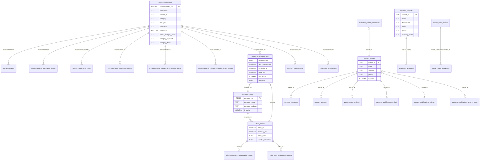

# データベーススキーマ

## 1. ER図

## 2. テーブル一覧（全35テーブル）

### 公告・入札関連

| テーブル | 概要 | PK | 書き込み元 |
|---------|------|-----|-----------|
| bid_announcements | 公告マスター | announcement_no | Engine |
| bid_requirements | 要件マスター | なし (requirement_no UNIQUE) | Engine |
| announcements_documents_master | ドキュメント情報 | doc_entry_id (BIGSERIAL) | Engine |
| bid_announcements_dates | 公告日付情報 | なし | Engine |
| announcements_estimated_amounts | 見積額 | なし | Engine (seed) |
| announcements_competing_companies_master | 競争参加企業 | なし | Engine (seed) |
| announcements_competing_company_bids_master | 競争参加入札額 | なし | Engine (seed) |
| similar_cases_master | 類似案件 | なし | Engine (seed) |
| similar_cases_competitors | 類似案件競争企業 | なし | Engine (seed) |
| source_pages | 公告ソースページ定義 | id | Engine |

### 判定結果関連

| テーブル | 概要 | PK | 書き込み元 |
|---------|------|-----|-----------|
| company_bid_judgement | 企業×公告の判定結果 | なし (UNIQUE複合) | Engine |
| sufficient_requirements | 充足要件詳細 | なし | Engine |
| insufficient_requirements | 不足要件詳細 | なし | Engine |

### 企業・拠点マスター

| テーブル | 概要 | PK | 書き込み元 |
|---------|------|-----|-----------|
| company_master | 企業マスター | company_no | Engine (seed) |
| office_master | 拠点マスター | なし | Engine (seed + step3) |
| office_registration_authorization_master | 拠点登録認可 | なし | Engine (seed) |
| office_work_achivements_master | 拠点工事実績 | office_experience_no | Engine (seed) |
| agency_master | 機関マスター | なし | Engine (seed) |
| construction_master | 工事種別マスター | なし | Engine (seed) |
| technician_qualification_master | 技術者資格マスター | なし | Engine (seed) |

### 協力会社（パートナー）関連

| テーブル | 概要 | PK | 書き込み元 |
|---------|------|-----|-----------|
| partners_master | 協力会社マスター | partner_id | Backend + seed |
| partners_categories | 協力会社カテゴリ | なし (UNIQUE複合) | Backend + seed |
| partners_branches | 協力会社支店 | なし | Backend + seed |
| partners_past_projects | 過去案件 | なし | Backend + seed |
| partners_qualifications_unified | 統一資格 | なし | seed |
| partners_qualifications_orderers | 発注者別資格 | なし | seed |
| partners_qualifications_orderer_items | 発注者別資格詳細 | なし | seed |

### ワークフロー・評価関連

| テーブル | 概要 | PK | 書き込み元 |
|---------|------|-----|-----------|
| backend_evaluation_statuses | 判定ワークフロー状態 | evaluationNo | Backend |
| evaluation_assignees | ワークフロー担当者割当 | (evaluation_no, step_id) | Backend |
| evaluation_orderer_workflow_states | 発注者ワークフロー状態 (JSONB) | evaluation_no | Backend |
| evaluation_partner_workflow_states | 協力会社ワークフロー状態 (JSONB) | evaluation_no | Backend |
| evaluation_partner_candidates | 協力会社候補 | id (BIGSERIAL) | Backend |
| evaluation_partner_files | 協力会社ファイル (BYTEA) | id (UUID) | Backend |
| workflow_contacts | 連絡先（担当者） | contact_id (UUID) | Backend |

### 発注者関連

| テーブル | 概要 | PK | 書き込み元 |
|---------|------|-----|-----------|
| bid_orderers | 発注者マスター | なし | seed |

## 3. 外部キー制約

実際にFKが定義されているのは **2箇所のみ**:

| FROM | TO | カラム |
|------|-----|--------|
| bid_announcements_dates | bid_announcements | announcement_no |
| evaluation_assignees | workflow_contacts | contact_id |

その他のテーブル間リレーションはすべて **アプリケーション層でのみ管理**（FK制約なし）。

## 4. 命名規則の問題

同一テーブル・同一DB内で3つの規則が混在:

| パターン | 例 | 該当テーブル |
|---------|-----|------------|
| camelCase | workName, bidType, doneOCR | bid_announcements, partners_master |
| snake_case | orderer_id, is_ocr_failed | bid_announcements, company_master |
| PascalCase | Located_Prefecture, Corporate_Reorganization_Flag | office_master, company_master |

## 5. announcement_id / announcement_no の型問題

| テーブル | カラム | 型 |
|---------|--------|-----|
| bid_announcements | announcement_no | INTEGER (PK) |
| announcements_documents_master | announcement_id | INTEGER |
| announcements_competing_companies_master | announcement_id | INTEGER |
| similar_cases_master | announcement_id | **TEXT** |
| similar_cases_competitors | similar_case_announcement_id | **TEXT** |

similar_cases 系のみ TEXT のままで、他テーブルとの JOIN で型不一致が発生する。
