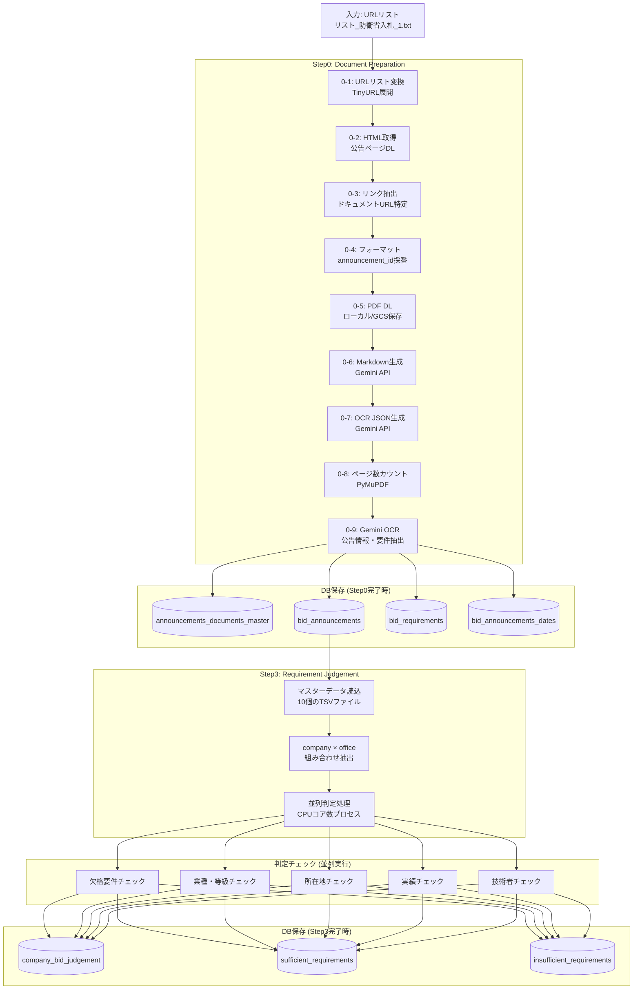
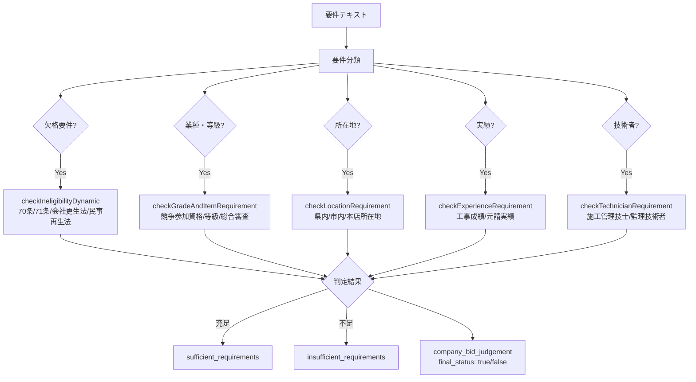
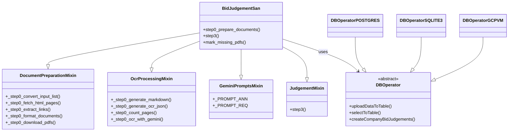

# Engine 処理パイプライン

## 1. 全体フロー



## 2. Step0 詳細

### 2-1. URLリスト変換 (`_step0_convert_input_list`)

- 入力: TSVファイル（公告ページのURL一覧）
- 処理: TinyURL等の短縮URLを展開
- 出力: `input_list_converted.txt`, `input_list_converted.html`

### 2-2. HTML取得 (`_step0_fetch_html_pages`)

- 入力: 変換済みURLリスト
- 処理: 各公告ページのHTMLをダウンロード
- 出力: `step0_html_DL/*.html`
- レート制限: `time.sleep(0.2)` でリクエスト間隔制御

### 2-3. リンク抽出 (`_step0_extract_links`)

- 入力: ダウンロード済みHTML
- 処理: HTML内の公告ドキュメントリンク（PDF等）を抽出
- 出力: `announcements_links.txt`

### 2-4. フォーマット (`_step0_format_documents`)

- 入力: URLリスト + 抽出リンク
- 処理: ドキュメント情報をDataFrameに整理、announcement_idを採番
- 出力: DataFrame (announcements_documents_master用)

### 2-5. PDF ダウンロード (`_step0_download_pdfs`)

- 入力: ドキュメントURL一覧
- 処理: PDFをローカルまたはGCSにダウンロード
- 出力: `output/pdf/pdf_XXXXX/*.pdf` またはGCS

### 2-6. Markdown生成 (`_step0_generate_markdown`)

- 入力: PDFファイル
- 処理: Gemini APIにPDFを送信し、Markdown要約を生成
- 出力: `output/markdown/md_XXXXX/*.md` またはGCS

### 2-7. OCR JSON生成 (`_step0_generate_ocr_json`)

- 入力: PDFファイル
- 処理: Gemini APIでPDFのOCR結果をJSON形式で取得
- 出力: `output/ocr_json/json_XXXXX/*.json` またはGCS

### 2-8. ページ数カウント (`_step0_count_pages`)

- 入力: PDFファイル
- 処理: PyMuPDFでページ数をカウント
- 出力: DataFrame.pageCount

### 2-9. Gemini OCR (`_step0_ocr_with_gemini`)

- 入力: PDFファイル
- 処理: Gemini APIで構造化情報を抽出
- 並列実行: 最大5並行、最大1000 API呼び出し/回
- 出力: 4テーブルへのINSERT

#### 抽出プロンプト

**公告情報 (_PROMPT_ANN)**:
- 工事場所、入札手続担当部局
- 公告日、入札方式
- 資料種類、カテゴリ
- 提出書類一覧（書類名、日付、意味）

**要件情報 (_PROMPT_REQ)**:
- 資格・条件テキスト
- 分類: 欠格/業種・等級/所在地/技術者/実績/その他

## 3. Step3 詳細

### 3-1. マスターデータ読込

TSVファイルから10種類のマスターデータを読み込み:

| ファイル | 内容 |
|---------|------|
| company_master.txt | 企業マスター |
| office_master.txt | 拠点マスター |
| office_registration_authorization_master.txt | 拠点登録認可 |
| office_work_achivements_master.txt | 拠点工事実績 |
| agency_master.txt | 機関マスター |
| construction_master.txt | 工事種別マスター |
| employee_master.txt | 従業員マスター |
| employee_qualification_master.txt | 従業員資格 |
| employee_experience_master.txt | 従業員実績 |
| technician_qualification_master.txt | 技術者資格マスター |

### 3-2. 要件判定チェック



### 3-3. 並列処理

- `multiprocessing` で CPUコア数分のプロセスを起動
- 各プロセスに company × office のチャンクを分配
- マスターデータはタプル引数でシリアライズして渡す

## 4. 外部サービス

| サービス | 用途 | 設定 |
|---------|------|------|
| Vertex AI / Gemini | OCR、情報抽出、Markdown生成 | `--vertex_ai_project_id`, `--gemini_model` (default: gemini-2.5-flash) |
| Google Cloud Storage | PDF/Markdown/OCR JSON保存 | `--use_gcp_vm` で有効化 |

## 5. CLI引数

```bash
python -m cli.entry \
  --vertex_ai_project_id PROJECT_ID \
  --vertex_ai_location asia-northeast1 \
  --gemini_model gemini-2.5-flash \
  --use_postgres \
  --postgres_host HOST \
  --postgres_port 5432 \
  --postgres_db DATABASE \
  --postgres_user USER \
  --postgres_password PASSWORD \
  --input_list_file リスト.txt \
  --run_step0_prepare_documents \
  --step0_do_fetch_html \
  --step0_do_extract_links \
  --step0_do_format_documents \
  --step0_do_download_pdfs \
  --step0_do_ocr \
  --step0_ocr_max_concurrency 5 \
  --step0_ocr_max_api_calls_per_run 1000
```

## 6. ユーティリティコマンド

| フラグ | 概要 |
|--------|------|
| `--mark_missing_pdfs` | 欠損PDFを検出してfile_404_flagを更新 |
| `--fill_markdown_paths_from_storage` | ストレージからMarkdownパスを補完 |
| `--run_markdown_from_db` | DBデータからMarkdown再生成 |
| `--run_ocr_json_from_db` | DBデータからOCR JSON再生成 |

## 7. クラス構成


