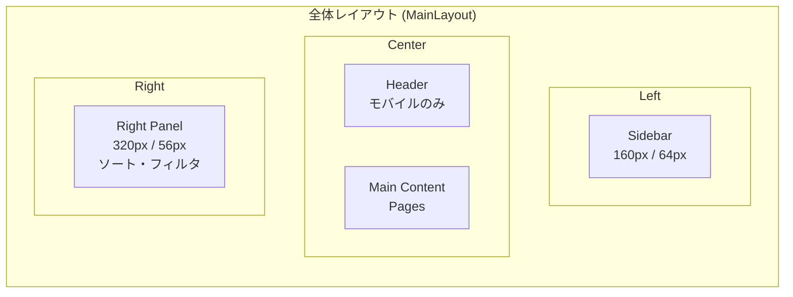
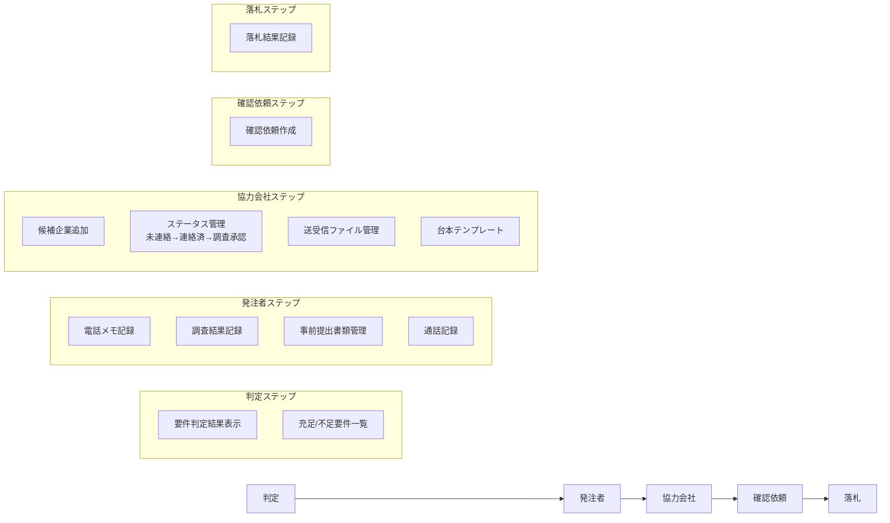
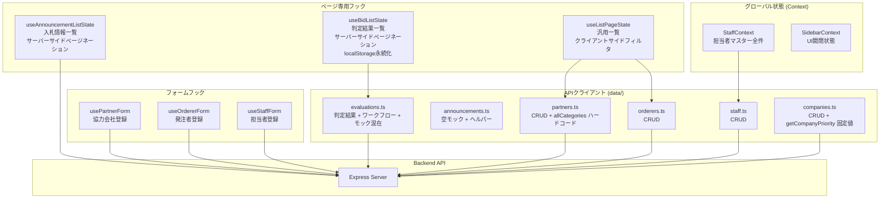

# Frontend 画面構成・遷移図

## 1. 画面遷移図

```mermaid
graph TD
    subgraph "サイドバーメニュー"
        NAV[Navigation]
    end

    subgraph "一覧ページ"
        BL[/ 判定結果一覧<br>BidListPage]
        AL[/announcements 入札情報一覧<br>AnnouncementListPage]
        PL[/partners 会社情報一覧<br>PartnerListPage]
        OL[/orderers 発注者一覧<br>OrdererListPage]
        SL[/staff 担当者一覧<br>StaffListPage]
    end

    subgraph "詳細ページ"
        BD[/detail/:id 判定結果詳細<br>BidDetailPage]
        AD[/announcements/:id 入札案件詳細<br>AnnouncementDetailPage]
        PD[/partners/:id 会社詳細<br>PartnerDetailPage]
        OD[/orderers/:id 発注者詳細<br>OrdererDetailPage]
    end

    subgraph "登録・編集"
        MR[/master/register マスター登録<br>MasterRegisterPage]
        MC[/master/register/confirm 登録確認<br>MasterRegisterConfirmPage]
    end

    AN[/analytics 分析<br>AnalyticsPage]

    NAV --> BL & AL & PL & OL & SL & MR & AN

    BL -->|カードクリック| BD
    AL -->|カードクリック| AD
    PL -->|カードクリック| PD
    OL -->|カードクリック| OD

    BD -->|類似案件クリック| AD
    BD -->|戻る| BL
    AD -->|戻る| AL
    PD -->|戻る| PL
    OD -->|戻る| OL

    PD -->|編集| MR
    OD -->|編集| MR
    MR -->|確認へ進む| MC
    MC -->|戻る| MR
    MC -->|確定| PL & OL & SL
```

## 2. 全ページ一覧

| URL | ページ | 概要 | API |
|-----|--------|------|-----|
| `/` | BidListPage | 判定結果一覧（カード形式） | GET /api/evaluations, GET /api/evaluations/status-counts |
| `/detail/:id` | BidDetailPage | 判定結果詳細（ワークフロー） | GET /api/evaluations/:id, PATCH, PUT assignees/workflow, GET similar-cases |
| `/announcements` | AnnouncementListPage | 入札案件一覧 | GET /api/announcements |
| `/announcements/:id` | AnnouncementDetailPage | 入札案件詳細 | GET /api/announcements/:id, GET progressing-companies, GET documents/preview |
| `/partners` | PartnerListPage | 会社情報一覧 | GET /api/partners |
| `/partners/:id` | PartnerDetailPage | 会社情報詳細 | GET /api/partners/:id, PATCH, DELETE |
| `/orderers` | OrdererListPage | 発注者一覧 | GET /api/orderers |
| `/orderers/:id` | OrdererDetailPage | 発注者詳細 | GET /api/orderers/:id, PATCH, DELETE |
| `/staff` | StaffListPage | 担当者一覧 | GET /api/contacts (via StaffContext) |
| `/analytics` | AnalyticsPage | 分析ダッシュボード | GET /api/evaluations/stats |
| `/master/register` | MasterRegisterPage | マスター登録フォーム（3タブ） | なし |
| `/master/register/confirm` | MasterRegisterConfirmPage | 登録確認・実行 | POST /api/partners, POST /api/orderers, POST /api/contacts |

## 3. レイアウト構成



### Sidebar メニュー項目

| アイコン | ラベル | パス |
|---------|--------|------|
| Assessment | 判定結果 | `/` |
| Article | 入札情報 | `/announcements` |
| Business | 会社情報 | `/partners` |
| AccountBalance | 発注者 | `/orderers` |
| People | 担当者 | `/staff` |
| AppRegistration | 登録 | `/master/register` |
| Analytics | 分析 | `/analytics` |

### Right Side Panel

- ソート条件セレクタ
- フィルタ複数選択（ステータス、カテゴリ、入札方式、都道府県等）
- 検索テキストフィールド
- アクティブフィルターのChip表示

## 4. BidDetailPage ワークフロー



### BidDetailPage のタブ構成

| メインタブ | 内容 |
|-----------|------|
| ワークフロー | 5ステップのワークフロー（上記） |
| 類似案件 | similar_cases_master からの類似案件表示 |
| 資料 | announcements_documents_master のドキュメントプレビュー |

### BidDetailPage の左右パネル

| パネル | 内容 |
|--------|------|
| 左パネル | 発注者情報、企業情報 |
| メインエリア | ワークフロータブ |
| 右パネル | 担当者割当、入札基本情報 |

## 5. データフロー



## 6. コンポーネント構成

### Layout

| コンポーネント | 役割 |
|-------------|------|
| MainLayout | 全体ラッパー（Sidebar + Main + Header） |
| Sidebar | 左ナビゲーション |
| RightSidePanel | 右側フィルタ・ソートパネル |

### Workflow (BidDetailPage 内)

| コンポーネント | ステップ | 概要 |
|-------------|---------|------|
| JudgmentSection | 判定 | 要件判定結果表示 |
| OrdererWorkflowSection | 発注者 | 電話メモ、調査結果 |
| PartnerSection | 協力会社 | 候補管理、ファイル送受信 |
| RequestSection | 確認依頼 | 確認依頼管理 |
| AwardSection | 落札 | 落札結果管理 |
| StaffAssignmentPanel | 共通 | 担当者割当 |
| SimilarCasesPanel | 類似案件 | 類似案件表示 |
| BidDocumentsSection | 資料 | ドキュメントプレビュー |
| BidInfoSection | 情報 | 入札基本情報 |

### Common

| コンポーネント | 役割 |
|-------------|------|
| ErrorBoundary | エラー境界 |
| FloatingBackButton | 浮遊戻るボタン |
| ScrollToTopButton | トップへスクロール |
| NotFoundView | 404表示 |
| CustomPagination | ページネーション |

### Form (MasterRegisterPage 内)

| コンポーネント | タブ | 概要 |
|-------------|------|------|
| PartnerRegisterForm | 会社 | 協力会社登録フォーム |
| OrdererRegisterForm | 発注者 | 発注者登録フォーム |
| StaffRegisterForm | 担当者 | 担当者登録フォーム |

## 7. レスポンシブ対応

| ブレークポイント | Sidebar | Right Panel |
|----------------|---------|-------------|
| Desktop (960px+) | 永続表示 (160px/64px) | 永続表示 (320px/56px) |
| Mobile (<960px) | モーダルドロワー (240px) | モーダルドロワー (300px) |
