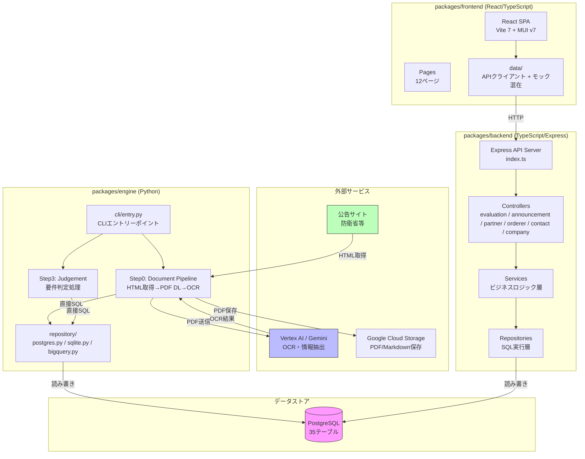
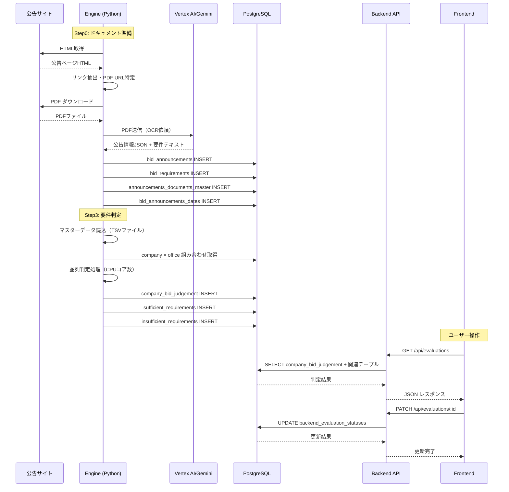

# システムアーキテクチャ概要

## 1. システム全体像

入札参加資格審査（判定）システム。公告情報を収集・OCR解析し、企業の入札参加資格を自動判定する。



## 2. パッケージ構成

```
judgesystem/
├── packages/
│   ├── engine/           # Python 判定エンジン
│   │   ├── cli/          #   CLIエントリーポイント
│   │   ├── application/  #   アプリケーションサービス
│   │   ├── domain/       #   ドメインロジック（OCR, 判定, パイプライン）
│   │   ├── repository/   #   DB操作（PostgreSQL/SQLite/BigQuery）
│   │   ├── requirements/ #   要件判定ロジック
│   │   └── sources/      #   公告ソース定義
│   │
│   ├── backend/          # TypeScript Express API
│   │   └── src/
│   │       ├── controllers/  # ルーティング + リクエスト処理
│   │       ├── services/     # ビジネスロジック
│   │       ├── repositories/ # SQL実行
│   │       ├── middleware/   # 認証・認可
│   │       └── types/        # 型定義
│   │
│   ├── frontend/         # React SPA
│   │   └── src/
│   │       ├── pages/        # 12ページコンポーネント
│   │       ├── components/   # 再利用コンポーネント
│   │       ├── hooks/        # カスタムフック
│   │       ├── contexts/     # グローバル状態
│   │       ├── data/         # APIクライアント層
│   │       ├── types/        # 型定義
│   │       └── constants/    # 定数・設定
│   │
│   └── shared/           # 共有型定義（TypeScript のみ）
│
├── db/
│   ├── migrations/       # SQLマイグレーション
│   └── seeds/            # シードデータ
│
├── deploy/               # Docker Compose
├── scripts/              # デプロイ・管理スクリプト
└── data/                 # マスターデータ（TSVファイル）
```

## 3. データフロー



## 4. 技術スタック

| 層 | 技術 | バージョン |
|---|------|-----------|
| Frontend | React + TypeScript | React 19 |
| UI Library | MUI (Material UI) | v7 |
| Bundler | Vite | 7 |
| Router | React Router | v7 |
| Backend | Express.js + TypeScript | - |
| DB | PostgreSQL | - |
| Engine | Python | 3.12 |
| AI/OCR | Vertex AI / Gemini | gemini-2.5-flash |
| PDF解析 | pdfplumber, PyMuPDF | - |
| ORM | なし（生SQL） | - |
| 認証 | JWT Bearer Token | - |
| ストレージ | Google Cloud Storage | - |
| デプロイ | Cloud Run + Docker | - |

## 5. 既知の設計問題

| 問題 | Issue | 影響 |
|------|-------|------|
| Engine と Backend が同じDBを独立に直接操作 | #120 | データ不整合、競合状態 |
| DBカラム命名規則の混在 | #121 | SQLバグの温床 |
| Frontend ページ肥大化・状態管理パターン乱立 | #122 | 保守性低下 |
| shared パッケージが TypeScript 限定 | #123 | Engine との型乖離 |
