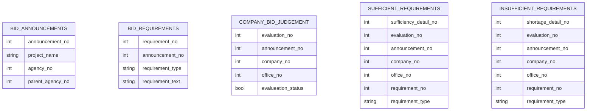

### ER図

```mermaid
erDiagram
    BID_ANNOUNCEMENTS {
        int announcement_no
        string project_name
        int agency_no
        int parent_agency_no
    }

    BID_REQUIREMENTS {
        int requirement_no
        int announcement_no
        string requirement_type
        string requirement_text
    }

    COMPANY_BID_JUDGEMENT {
        int evaluation_no
        int announcement_no
        int company_no
        int office_no
        bool evalueation_status
    }

    SUFFICIENT_REQUIREMENTS {
        int sufficiency_detail_no
        int evaluation_no
        int announcement_no
        int company_no
        int office_no
        int requirement_no
        string requirement_type
    }

    INSUFFICIENT_REQUIREMENTS {
        int shortage_detail_no
        int evaluation_no
        int announcement_no
        int company_no
        int office_no
        int requirement_no
        string requirement_type
    }

```
