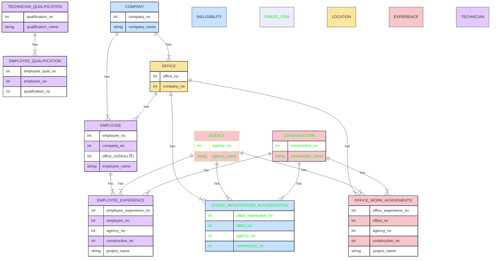

### ER図

```mermaid
erDiagram
    AGENCY {
        int agency_no
        string agency_name
    }

    COMPANY {
        int company_no
        string company_name
    }

    CONSTRUCTION {
        int construction_no
        string construction_name
    }

    EMPLOYEE_EXPERIENCE {
        int employee_experience_no
        int employee_no
        int agency_no
        int construction_no
        string project_name
    }

    EMPLOYEE {
        int employee_no
        int company_no
        int office_no(NULL可)
        string employee_name
    }

    EMPLOYEE_QUALIFICATION {
        int employee_qual_no
        int employee_no
        int qualification_no
    }

    OFFICE {
        int office_no
        int company_no
    }

    OFFICE_REGISTRATION_AUTHORIZATION {
        int office_registration_no
        int office_no
        int agency_no
        int construction_no
    }

    OFFICE_WORK_ACHIVEMENTS {
        int office_experience_no
        int office_no
        int agency_no
        int construction_no
        string project_name
    }

    TECHNICIAN_QUALIFICATION {
        int qualification_no
        string qualification_name
    }

    INELIGIBILITY {}
    GRADE_ITEM {}
    LOCATION {}
    EXPERIENCE {}
    TECHNICIAN {}

    COMPANY ||--}| OFFICE : has
    COMPANY ||--}| EMPLOYEE : has
    OFFICE ||--}| EMPLOYEE : has

    EMPLOYEE ||--}| EMPLOYEE_EXPERIENCE : has
    AGENCY ||--}| EMPLOYEE_EXPERIENCE : has
    CONSTRUCTION ||--}| EMPLOYEE_EXPERIENCE : has

    OFFICE ||--}| OFFICE_REGISTRATION_AUTHORIZATION : has
    AGENCY ||--}| OFFICE_REGISTRATION_AUTHORIZATION : has
    CONSTRUCTION ||--}| OFFICE_REGISTRATION_AUTHORIZATION : has

    OFFICE ||--}| OFFICE_WORK_ACHIVEMENTS : has
    AGENCY ||--}| OFFICE_WORK_ACHIVEMENTS : has
    CONSTRUCTION ||--}| OFFICE_WORK_ACHIVEMENTS : has

    TECHNICIAN_QUALIFICATION ||--}| EMPLOYEE_QUALIFICATION : has

    %% パステルブルー
    classDef COLOR_INELIGIBILITY fill:#c6e2ff,stroke:#333,stroke-width:1px
    %% パステルグリーン
    classDef COLOR_GRADE_ITEM stroke:#333,stroke-width:1px,color:#00f500
    %% パステルイエロー
    classDef COLOR_LOCATION fill:#f9e79f,stroke:#333,stroke-width:1px
    %% パステルピンク
    classDef COLOR_EXPERIENCE fill:#f5c6cb,stroke:#333,stroke-width:1px
    %% パステルグレープ
    classDef COLOR_TECHNICIAN fill:#e3c9ff,stroke:#333,stroke-width:1px
    %% office_registration用カラー
    classDef COLOR_OFFICE_REGISTRATION_AUTHORIZATION fill:#c6e2ff,stroke:#333,stroke-width:1px,color:#00f500
    %% agency用カラー
    classDef COLOR_AGENCY fill:#f5c6cb,stroke:#f9e79f,stroke-width:1px,color:#00f500
    %% construction用カラー
    classDef COLOR_CONSTRUCTION fill:#f5c6cb,stroke:#333,stroke-width:1px,color:#00f500

    class INELIGIBILITY COLOR_INELIGIBILITY
    class COMPANY COLOR_INELIGIBILITY

    class GRADE_ITEM COLOR_GRADE_ITEM

    class LOCATION COLOR_LOCATION
    class OFFICE COLOR_LOCATION

    class EXPERIENCE COLOR_EXPERIENCE
    class OFFICE_WORK_ACHIVEMENTS COLOR_EXPERIENCE

    class TECHNICIAN COLOR_TECHNICIAN
    class EMPLOYEE COLOR_TECHNICIAN
    class EMPLOYEE_EXPERIENCE COLOR_TECHNICIAN
    class EMPLOYEE_QUALIFICATION COLOR_TECHNICIAN
    class TECHNICIAN_QUALIFICATION COLOR_TECHNICIAN

    class OFFICE_REGISTRATION_AUTHORIZATION COLOR_OFFICE_REGISTRATION_AUTHORIZATION
    class AGENCY COLOR_AGENCY
    class CONSTRUCTION COLOR_CONSTRUCTION

```
