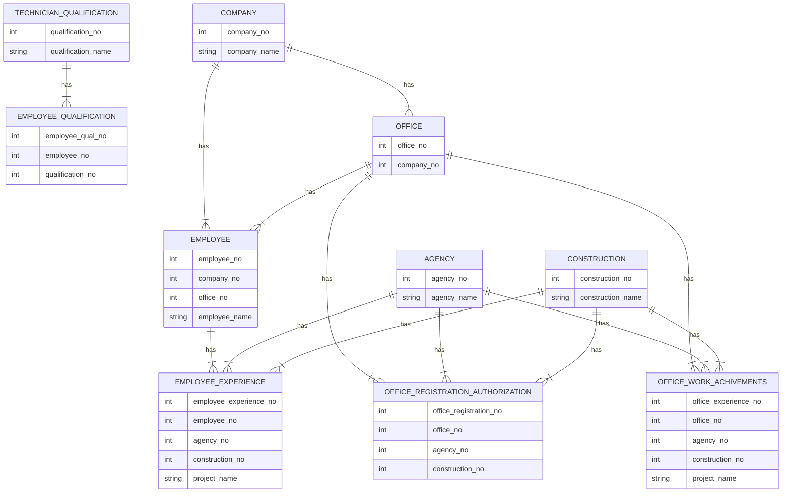

### ER図

```mermaid
erDiagram
    AGENCY {
        int agency_no
        string agency_name
    }

    COMPANY {
        int company_no
        string company_name
    }

    CONSTRUCTION {
        int construction_no
        string construction_name
    }

    EMPLOYEE_EXPERIENCE {
        int employee_experience_no
        int employee_no
        int agency_no
        int construction_no
        string project_name
    }

    EMPLOYEE {
        int employee_no
        int company_no
        int office_no
        string employee_name
    }

    EMPLOYEE_QUALIFICATION {
        int employee_qual_no
        int employee_no
        int qualification_no
    }

    OFFICE {
        int office_no
        int company_no
    }

    OFFICE_REGISTRATION_AUTHORIZATION {
        int office_registration_no
        int office_no
        int agency_no
        int construction_no
    }

    OFFICE_WORK_ACHIVEMENTS {
        int office_experience_no
        int office_no
        int agency_no
        int construction_no
        string project_name
    }

    TECHNICIAN_QUALIFICATION {
        int qualification_no
        string qualification_name
    }

    COMPANY ||--}| OFFICE : has
    COMPANY ||--}| EMPLOYEE : has
    OFFICE ||--}| EMPLOYEE : has

    EMPLOYEE ||--}| EMPLOYEE_EXPERIENCE : has
    AGENCY ||--}| EMPLOYEE_EXPERIENCE : has
    CONSTRUCTION ||--}| EMPLOYEE_EXPERIENCE : has

    OFFICE ||--}| OFFICE_REGISTRATION_AUTHORIZATION : has
    AGENCY ||--}| OFFICE_REGISTRATION_AUTHORIZATION : has
    CONSTRUCTION ||--}| OFFICE_REGISTRATION_AUTHORIZATION : has

    OFFICE ||--}| OFFICE_WORK_ACHIVEMENTS : has
    AGENCY ||--}| OFFICE_WORK_ACHIVEMENTS : has
    CONSTRUCTION ||--}| OFFICE_WORK_ACHIVEMENTS : has

    TECHNICIAN_QUALIFICATION ||--}| EMPLOYEE_QUALIFICATION : has

```
